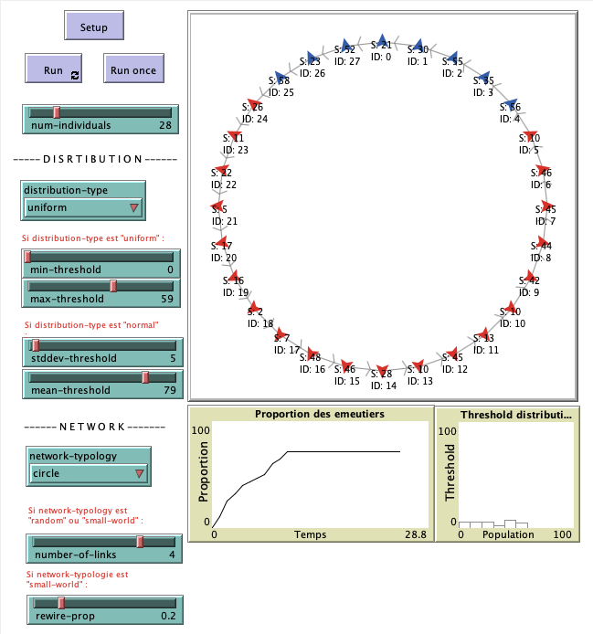

# Simulation d'Émeutes avec NetLogo

Ce projet implémente une simulation d'émeutes en utilisant NetLogo. Les individus (tortues) changent de comportement en fonction de leur seuil d'influence et des interactions avec leurs voisins.

## Fonctionnalités
- **Initialisation** : Distribution des seuils uniforme ou normale.
- **Simulation** : Mise à jour des états des individus à chaque tick.
- **Graphiques** : Évolution de la proportion des émeutiers et histogramme des seuils.
- **Paramètres personnalisables** : Typologie du réseau et distributions des seuils.

## Instructions
1. Ouvrez le fichier `.nlogo` dans NetLogo.
2. Configurez les paramètres dans l'interface.
3. Lancez la simulation avec le bouton `setup`, puis `go`.
